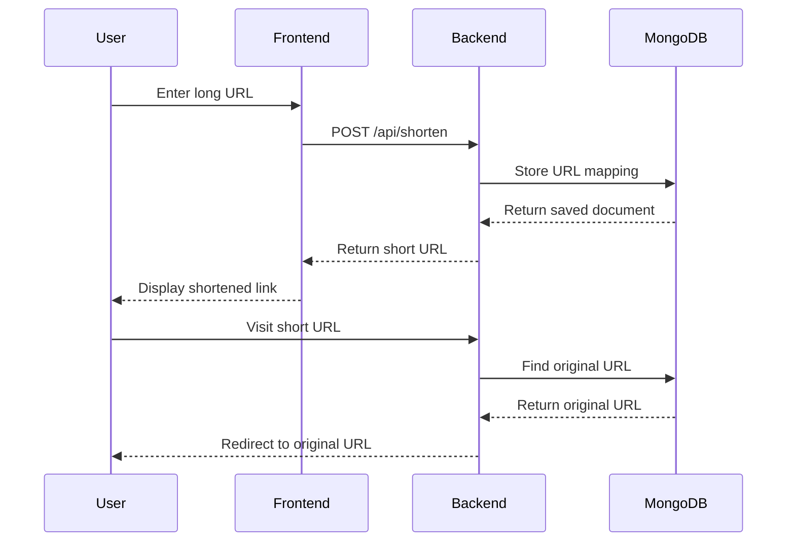

# 🔗 URL Shortener

> A modern, full-stack URL shortening service built with Next.js, Node.js, and MongoDB

[](https://nextjs.org/)
[](https://nodejs.org/)
[](https://mongodb.com/)
[](https://expressjs.com/)

## ✨ Features

- 🚀 **Fast URL Shortening** - Convert long URLs into short, shareable links instantly
- 📋 **One-Click Copy** - Copy shortened links to clipboard with a single click
- 🔄 **Automatic Redirection** - Seamless redirection from short URLs to original destinations
- 💾 **Persistent Storage** - MongoDB database for reliable URL storage
- 📱 **Responsive Design** - Modern, mobile-friendly interface
- ⚡ **Real-time Updates** - Instant feedback and URL generation
- 📊 **Click Analytics** - Track how many times your URLs have been accessed
- 🛡️ **Rate Limiting** - Built-in security to prevent abuse
- 🎨 **Modern UI** - Beautiful interface built with Tailwind CSS

## 🏗️ Architecture

```
📦 URL Shortener
├── 🎨 frontend/          # Next.js React application
│   ├── pages/            # Next.js pages and API routes
│   ├── components/       # Reusable React components
│   ├── styles/           # CSS and styling files
│   ├── utils/            # Frontend utility functions
│   └── public/           # Static assets
├── 🔧 backend/           # Node.js Express server
│   ├── models/           # MongoDB schemas
│   ├── routes/           # API route handlers
│   ├── middleware/       # Custom middleware
│   ├── utils/            # Helper functions
│   └── server.js         # Main server file
├── 📚 README.md          # Project documentation
├── 🚀 setup.sh           # Automated setup script
└── 🔄 dev.sh             # Development start script
```

## 🛠️ Tech Stack

| Layer | Technology | Purpose |
|-------|------------|---------|
| **Frontend** | Next.js 13+ | React framework with SSR/SSG |
| **Styling** | Tailwind CSS | Utility-first CSS framework |
| **Backend** | Node.js + Express | RESTful API server |
| **Database** | MongoDB + Mongoose | Document database with ODM |
| **Deployment** | Vercel + Railway | Frontend and backend hosting |

## 🚀 Quick Start

### Prerequisites

- Node.js 18+ installed
- MongoDB running locally or MongoDB Atlas account
- Git for version control

### Option 1: Automated Setup (Recommended)

```bash
# Clone the repository
git clone https://github.com/yourusername/url-shortener.git
cd url-shortener

# Run the setup script
./setup.sh

# Start development servers
./dev.sh
```

### Option 2: Manual Setup

#### 1️⃣ Clone & Navigate

```bash
git clone https://github.com/yourusername/url-shortener.git
cd url-shortener
```

#### 2️⃣ Backend Setup

```bash
# Navigate to backend directory
cd backend

# Install dependencies
npm install

# Create environment file
touch .env
```

Add the following to your `.env` file:

```env
PORT=5000
MONGO_URI=mongodb://localhost:27017/urlshortener
BASE_URL=http://localhost:5000
NODE_ENV=development
```

```bash
# Start the backend server (development)
npm run dev

# Or start in production mode
npm start
```

✅ Backend running at `http://localhost:5000`

#### 3️⃣ Frontend Setup

```bash
# Navigate to frontend directory (from project root)
cd frontend

# Install dependencies
npm install

# Create environment file
touch .env.local
```

Add the following to your `.env.local` file:

```env
NEXT_PUBLIC_API_URL=http://localhost:5000
NEXT_PUBLIC_BASE_URL=http://localhost:3000
```

```bash
# Start the development server
npm run dev
```

✅ Frontend running at `http://localhost:3000`

## 🔄 How It Works



## 📡 API Reference

### Shorten URL

```http
POST /api/shorten
```

**Request Body:**
```json
{
  "longUrl": "https://example.com/very-long-url-that-needs-shortening"
}
```

**Response:**
```json
{
  "success": true,
  "data": {
    "shortUrl": "http://localhost:5000/abc123",
    "longUrl": "https://example.com/very-long-url-that-needs-shortening",
    "shortCode": "abc123",
    "clicks": 0,
    "createdAt": "2024-01-15T10:30:00.000Z"
  }
}
```

### Redirect to Original URL

```http
GET /:shortCode
```

**Response:** `302 Redirect` to the original URL

### Get URL Statistics

```http
GET /api/stats/:shortCode
```

**Response:**
```json
{
  "success": true,
  "data": {
    "shortUrl": "http://localhost:5000/abc123",
    "longUrl": "https://example.com/very-long-url-that-needs-shortening",
    "shortCode": "abc123",
    "clicks": 42,
    "createdAt": "2024-01-15T10:30:00.000Z",
    "updatedAt": "2024-01-15T15:45:00.000Z"
  }
}
```

## 🧪 Testing

```bash
# Backend tests
cd backend
npm test

# Frontend tests
cd frontend
npm test

# Test the API manually
curl -X POST http://localhost:5000/api/shorten \
  -H "Content-Type: application/json" \
  -d '{"longUrl": "https://example.com/very-long-url"}'
```

## 🚀 Deployment

### Backend (Railway/Heroku)

1. Create a new project on Railway or Heroku
2. Connect your GitHub repository
3. Set environment variables in the dashboard:
   - `MONGO_URI`: Your MongoDB connection string
   - `BASE_URL`: Your deployed backend URL
   - `NODE_ENV`: `production`
4. Deploy automatically on push to main branch

### Frontend (Vercel)

1. Connect your GitHub repository to Vercel
2. Set environment variables in project settings:
   - `NEXT_PUBLIC_API_URL`: Your deployed backend URL
   - `NEXT_PUBLIC_BASE_URL`: Your deployed frontend URL
3. Deploy automatically on push to main branch

## 📁 Project Structure Details

```
url-shortener/
├── backend/
│   ├── models/
│   │   └── Url.js              # MongoDB URL schema
│   ├── routes/
│   │   └── url.js              # API routes for URL operations
│   ├── middleware/
│   │   ├── errorHandler.js     # Global error handling
│   │   └── rateLimiter.js      # Rate limiting middleware
│   ├── utils/
│   │   └── helpers.js          # Utility functions
│   ├── .env                    # Environment variables
│   ├── .gitignore             # Git ignore rules
│   ├── package.json           # Dependencies and scripts
│   └── server.js              # Main server file
├── frontend/
│   ├── components/
│   │   ├── Header.js          # Navigation header
│   │   ├── Footer.js          # Site footer
│   │   ├── UrlShortener.js    # Main URL shortening form
│   │   ├── Features.js        # Features showcase
│   │   └── HowItWorks.js      # How it works section
│   ├── pages/
│   │   ├── _app.js            # Next.js app wrapper
│   │   ├── _document.js       # Custom document
│   │   └── index.js           # Home page
│   ├── styles/
│   │   └── globals.css        # Global styles with Tailwind
│   ├── utils/
│   │   └── api.js             # API utility functions
│   ├── .env.local             # Environment variables
│   ├── .gitignore            # Git ignore rules
│   ├── next.config.js        # Next.js configuration
│   ├── package.json          # Dependencies and scripts
│   ├── postcss.config.js     # PostCSS configuration
│   └── tailwind.config.js    # Tailwind CSS configuration
├── .gitignore                 # Root git ignore
├── README.md                  # This file
├── setup.sh                   # Automated setup script
└── dev.sh                     # Development start script
```

## 🤝 Contributing

1. Fork the repository
2. Create a feature branch (`git checkout -b feature/amazing-feature`)
3. Commit your changes (`git commit -m 'Add amazing feature'`)
4. Push to the branch (`git push origin feature/amazing-feature`)
5. Open a Pull Request

## 📄 License

This project is licensed under the MIT License - see the [LICENSE](LICENSE) file for details.

## 🙏 Acknowledgments

- [Next.js](https://nextjs.org/) for the amazing React framework
- [Express.js](https://expressjs.com/) for the lightweight backend framework
- [MongoDB](https://mongodb.com/) for the flexible database solution
- [Tailwind CSS](https://tailwindcss.com/) for the utility-first styling
- [React Icons](https://react-icons.github.io/react-icons/) for the beautiful icons

## 🐛 Troubleshooting

### Common Issues

**MongoDB Connection Error:**
```bash
# Make sure MongoDB is running
sudo systemctl start mongod

# Or check if MongoDB is installed
mongod --version
```

**Port Already in Use:**
```bash
# Kill process using port 5000
sudo lsof -t -i tcp:5000 | xargs kill -9

# Kill process using port 3000
sudo lsof -t -i tcp:3000 | xargs kill -9
```

**Environment Variables Not Loading:**
- Make sure `.env` files are in the correct directories
- Restart the servers after changing environment variables
- Check that variable names match exactly (case-sensitive)

## 📞 Support

If you encounter any issues or have questions:

1. Check the [Issues](https://github.com/yourusername/url-shortener/issues) page
2. Create a new issue with detailed information
3. Contact the maintainer at [your-email@example.com](mailto:your-email@example.com)

---

<div align="center">
  <p>Made with ❤️ by <a href="https://github.com/yourusername">Your Name</a></p>
  <p>⭐ Star this repo if you found it helpful!</p>
</div>
